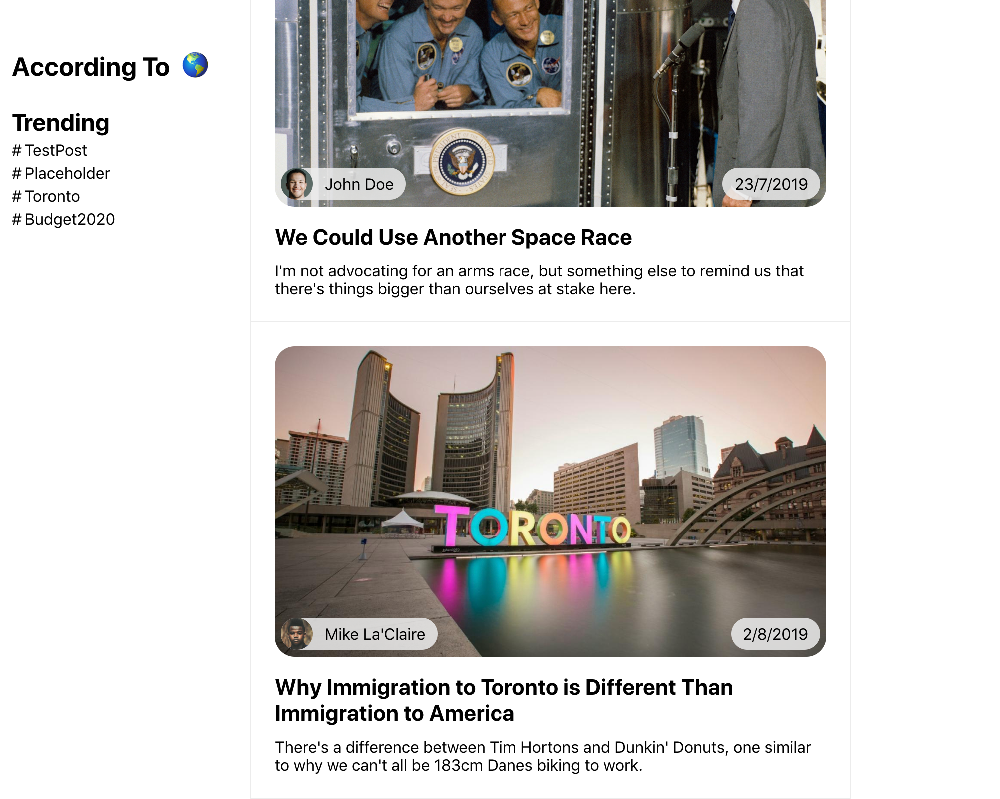

# 🌎 According To

**According To** (AT) is a prototype blog platform that attempts to reduce combative social tendencies by better framing each post as merely someone's opinion.

It is a portfolio project of mine ([Dylan Landry](https://www.dylanlandry.com)) to demonstrate that I am competent with...
- React
- Test driven development. 

This is the AT _client_. For the AT _API_, visit the [AT API GitHub repository](https://github.com/dyllandry/according-to-api).

## Install
- `npm install`

## Dependencies
This project depends on the [AT API](https://github.com/dyllandry/according-to-api) to work. The AT API respectively needs a local MongoDB database, too, so there's a bit of setup.

## Environment Variables
Make sure to tweak the variables contained by the `.env` file to your environment's specifications.

## Testing
A focus of this project is test driven development. The tests are contained by `src` subdirectories named `__tests__`.

To test the application, run `npm run test`.

**Warning**: GraphQL queries are also tested for validity against the GraphQL server's schema. Before `npm run test` is executed, the GraphQL schema is downloaded. This download occurs from the url specified by the `REACT_APP_GRAPHQL_ENDPOINT` environment variable detailed by the `.env` file. If this variable is not set, or downloading the GraphQL schema fails, the tests will not run. Testing requires a fresh GraphQL schema first be downloaded to ensure no tests are stale.

---

The following is the create-react-app boiler readme. 

Au revior 👋!

---

This project was bootstrapped with [Create React App](https://github.com/facebook/create-react-app).

## Available Scripts

In the project directory, you can run:

### `npm start`

Runs the app in the development mode. 
Open [http://localhost:3000](http://localhost:3000) to view it in the browser.

The page will reload if you make edits. 
You will also see any lint errors in the console.

### `npm test`

Launches the test runner in the interactive watch mode. 
See the section about [running tests](https://facebook.github.io/create-react-app/docs/running-tests) for more information.

### `npm run build`

Builds the app for production to the `build` folder. 
It correctly bundles React in production mode and optimizes the build for the best performance.

The build is minified and the filenames include the hashes. 
Your app is ready to be deployed!

See the section about [deployment](https://facebook.github.io/create-react-app/docs/deployment) for more information.

### `npm run eject`

**Note: this is a one-way operation. Once you `eject`, you can’t go back!**

If you aren’t satisfied with the build tool and configuration choices, you can `eject` at any time. This command will remove the single build dependency from your project.

Instead, it will copy all the configuration files and the transitive dependencies (Webpack, Babel, ESLint, etc) right into your project so you have full control over them. All of the commands except `eject` will still work, but they will point to the copied scripts so you can tweak them. At this point you’re on your own.

You don’t have to ever use `eject`. The curated feature set is suitable for small and middle deployments, and you shouldn’t feel obligated to use this feature. However we understand that this tool wouldn’t be useful if you couldn’t customize it when you are ready for it.

## Learn More

You can learn more in the [Create React App documentation](https://facebook.github.io/create-react-app/docs/getting-started).

To learn React, check out the [React documentation](https://reactjs.org/).
